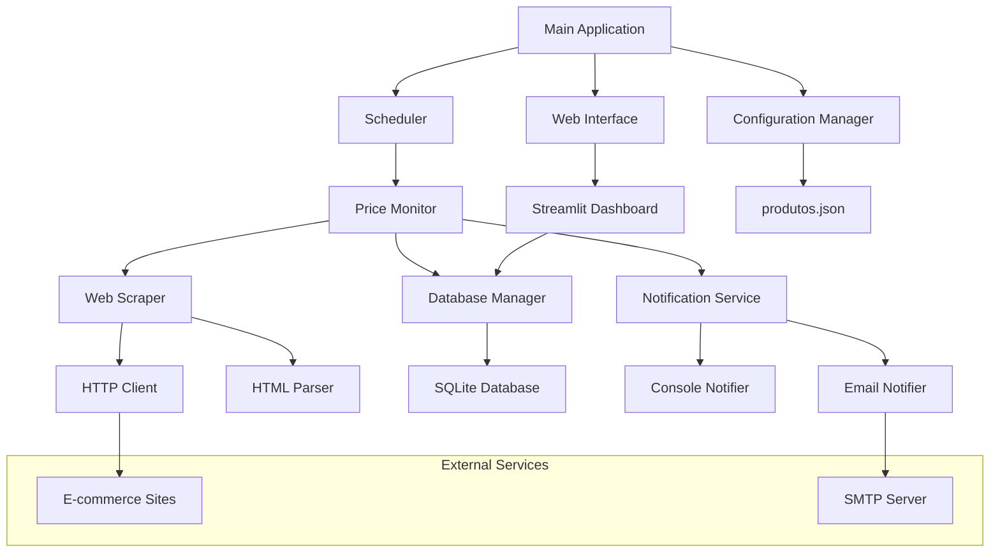

# Design Document - Sistema de Monitoramento de Preços Online

## Overview

O Sistema de Monitoramento de Preços Online é uma aplicação Python modular que combina web scraping, armazenamento de dados, agendamento de tarefas e interface web. O sistema utiliza uma arquitetura baseada em componentes separados para facilitar manutenção, testes e extensibilidade.

A aplicação opera em dois modos principais:
1. **Modo Daemon**: Execução contínua com agendamento automático de coletas
2. **Modo Interface**: Servidor web Streamlit para visualização e configuração

## Architecture



### Core Components

1. **Configuration Manager**: Gerencia configurações de produtos e sistema
2. **Price Monitor**: Orquestra o processo de monitoramento
3. **Web Scraper**: Extrai dados de preços de sites
4. **Database Manager**: Gerencia persistência de dados
5. **Notification Service**: Envia alertas quando necessário
6. **Scheduler**: Controla execução periódica
7. **Web Interface**: Interface Streamlit para visualização

## Components and Interfaces

### 1. Configuration Manager (`config_manager.py`)

```python
class ConfigManager:
    def load_products_config(self) -> List[ProductConfig]
    def save_products_config(self, products: List[ProductConfig]) -> None
    def get_system_config(self) -> SystemConfig
    def validate_product_config(self, product: ProductConfig) -> bool
```

**Responsabilidades:**
- Carregar e validar configurações do arquivo `produtos.json`
- Gerenciar configurações do sistema (intervalos, timeouts, etc.)
- Criar arquivo de configuração padrão se não existir

### 2. Web Scraper (`scraper.py`)

```python
class WebScraper:
    def __init__(self, timeout: int = 10, retries: int = 3)
    def scrape_product(self, url: str, selectors: Dict[str, List[str]]) -> ProductData
    def _extract_price(self, soup: BeautifulSoup, selectors: List[str]) -> float
    def _extract_name(self, soup: BeautifulSoup, selectors: List[str]) -> str
    def _make_request(self, url: str) -> requests.Response
```

**Responsabilidades:**
- Fazer requisições HTTP com retry e timeout
- Extrair dados usando múltiplos seletores CSS/XPath
- Tratar diferentes formatos de preço (R$ 1.234,56, etc.)
- Implementar rate limiting para evitar bloqueios

**Estratégias de Scraping:**
- User-Agent rotation para evitar detecção
- Seletores múltiplos por site para robustez
- Parsing inteligente de preços com regex
- Headers customizados por domínio

### 3. Database Manager (`database.py`)

```python
class DatabaseManager:
    def __init__(self, db_path: str = "precos.db")
    def create_tables(self) -> None
    def insert_price_record(self, record: PriceRecord) -> None
    def get_price_history(self, product_name: str, days: int = 30) -> List[PriceRecord]
    def get_latest_prices(self) -> List[PriceRecord]
    def cleanup_old_records(self, days: int = 365) -> None
```

**Schema do Banco:**
```sql
CREATE TABLE IF NOT EXISTS precos (
    id INTEGER PRIMARY KEY AUTOINCREMENT,
    nome_produto TEXT NOT NULL,
    url TEXT NOT NULL,
    preco REAL NOT NULL,
    preco_alvo REAL NOT NULL,
    data_hora TIMESTAMP DEFAULT CURRENT_TIMESTAMP,
    status TEXT DEFAULT 'active',
    erro TEXT NULL,
    INDEX idx_produto_data (nome_produto, data_hora),
    INDEX idx_data_hora (data_hora)
);

CREATE TABLE IF NOT EXISTS configuracoes (
    chave TEXT PRIMARY KEY,
    valor TEXT NOT NULL,
    data_atualizacao TIMESTAMP DEFAULT CURRENT_TIMESTAMP
);
```

### 4. Price Monitor (`price_monitor.py`)

```python
class PriceMonitor:
    def __init__(self, config_manager: ConfigManager, scraper: WebScraper, 
                 db_manager: DatabaseManager, notifier: NotificationService)
    def monitor_all_products(self) -> MonitoringResult
    def monitor_single_product(self, product: ProductConfig) -> ProductResult
    def check_price_alerts(self, current_price: float, target_price: float) -> bool
```

**Responsabilidades:**
- Coordenar processo completo de monitoramento
- Gerenciar paralelização de coletas
- Implementar lógica de alertas
- Coletar métricas de performance

### 5. Notification Service (`notifications.py`)

```python
class NotificationService:
    def __init__(self, console_enabled: bool = True, email_enabled: bool = False)
    def send_price_alert(self, product: ProductConfig, current_price: float) -> None
    def send_system_alert(self, message: str, level: str = "INFO") -> None
    def send_email(self, subject: str, body: str, to_email: str) -> bool
```

**Tipos de Notificação:**
- Console: Logs coloridos com detalhes do produto
- Email: HTML formatado com histórico de preços
- Futuro: Telegram, Slack, WhatsApp

### 6. Streamlit Interface (`streamlit_app.py`)

```python
def main():
    st.set_page_config(page_title="Monitor de Preços", layout="wide")
    
    # Sidebar para configurações
    with st.sidebar:
        show_configuration_panel()
    
    # Main content
    show_dashboard()
    show_price_charts()
    show_product_management()

def show_dashboard():
    # Métricas gerais, produtos monitorados, alertas recentes
    
def show_price_charts():
    # Gráficos interativos com Plotly
    
def show_product_management():
    # CRUD de produtos monitorados
```

**Funcionalidades da Interface:**
- Dashboard com métricas em tempo real
- Gráficos interativos de histórico de preços
- Gerenciamento de produtos (adicionar/remover/editar)
- Configurações do sistema
- Logs e status de execução

## Data Models

### ProductConfig
```python
@dataclass
class ProductConfig:
    nome: str
    url: str
    preco_alvo: float
    ativo: bool = True
    seletores_personalizados: Optional[Dict[str, List[str]]] = None
    intervalo_minimo: int = 3600  # segundos entre coletas
```

### PriceRecord
```python
@dataclass
class PriceRecord:
    id: Optional[int]
    nome_produto: str
    url: str
    preco: float
    preco_alvo: float
    data_hora: datetime
    status: str = "active"
    erro: Optional[str] = None
```

### MonitoringResult
```python
@dataclass
class MonitoringResult:
    total_products: int
    successful_scrapes: int
    failed_scrapes: int
    alerts_sent: int
    execution_time: float
    errors: List[str]
```

## Error Handling

### Estratégia de Tratamento de Erros

1. **Network Errors**: Retry com backoff exponencial (1s, 2s, 4s)
2. **Parsing Errors**: Tentar seletores alternativos, log detalhado
3. **Database Errors**: Transações com rollback, reconexão automática
4. **Configuration Errors**: Validação na inicialização, fallbacks
5. **Rate Limiting**: Detecção automática e ajuste de delays

### Logging Strategy

```python
import logging
from logging.handlers import RotatingFileHandler

# Configuração de logs
logging.basicConfig(
    level=logging.INFO,
    format='%(asctime)s - %(name)s - %(levelname)s - %(message)s',
    handlers=[
        RotatingFileHandler('price_monitor.log', maxBytes=10*1024*1024, backupCount=5),
        logging.StreamHandler()
    ]
)
```

**Níveis de Log:**
- DEBUG: Detalhes de scraping, queries SQL
- INFO: Início/fim de execuções, produtos processados
- WARNING: Falhas recuperáveis, rate limiting
- ERROR: Falhas de scraping, problemas de configuração
- CRITICAL: Falhas de sistema, problemas de banco

## Testing Strategy

### Unit Tests
- **ConfigManager**: Validação de configurações, parsing JSON
- **WebScraper**: Mocking de requests, parsing HTML
- **DatabaseManager**: Operações CRUD, integridade de dados
- **NotificationService**: Envio de notificações, formatação

### Integration Tests
- **End-to-end**: Fluxo completo de monitoramento
- **Database**: Persistência e recuperação de dados
- **Web Interface**: Navegação e funcionalidades

### Test Data
```python
# Fixtures para testes
SAMPLE_PRODUCTS = [
    {
        "nome": "Produto Teste",
        "url": "https://example.com/produto",
        "preco_alvo": 100.0
    }
]

MOCK_HTML_RESPONSES = {
    "amazon": "<span class='a-price-whole'>99</span>",
    "mercadolivre": "<span class='price-tag-fraction'>89</span>"
}
```

### Performance Testing
- **Load Testing**: Múltiplos produtos simultâneos
- **Memory Testing**: Monitoramento de vazamentos
- **Database Performance**: Queries com grandes volumes

## Security Considerations

1. **Rate Limiting**: Respeitar robots.txt e implementar delays
2. **User-Agent**: Rotation para evitar bloqueios
3. **Data Validation**: Sanitização de URLs e dados de entrada
4. **Error Information**: Não expor informações sensíveis em logs
5. **Database**: Prepared statements para evitar SQL injection
6. **Email**: Validação de endereços, rate limiting de envios

## Deployment and Configuration

### Environment Variables
```bash
# Configurações opcionais
PRICE_MONITOR_DB_PATH=./data/precos.db
PRICE_MONITOR_LOG_LEVEL=INFO
PRICE_MONITOR_EMAIL_ENABLED=false
PRICE_MONITOR_SMTP_SERVER=smtp.gmail.com
PRICE_MONITOR_SMTP_PORT=587
```

### Docker Support (Futuro)
```dockerfile
FROM python:3.11-slim
WORKDIR /app
COPY requirements.txt .
RUN pip install -r requirements.txt
COPY . .
CMD ["python", "main.py"]
```

### Systemd Service (Linux)
```ini
[Unit]
Description=Price Monitor Service
After=network.target

[Service]
Type=simple
User=priceuser
WorkingDirectory=/opt/price-monitor
ExecStart=/usr/bin/python3 main.py
Restart=always

[Install]
WantedBy=multi-user.target
```